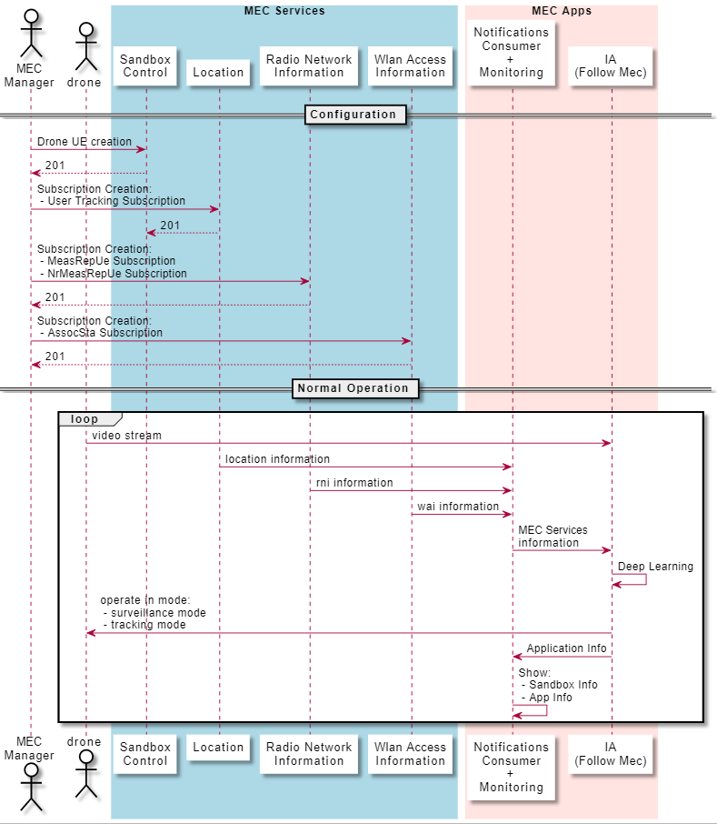
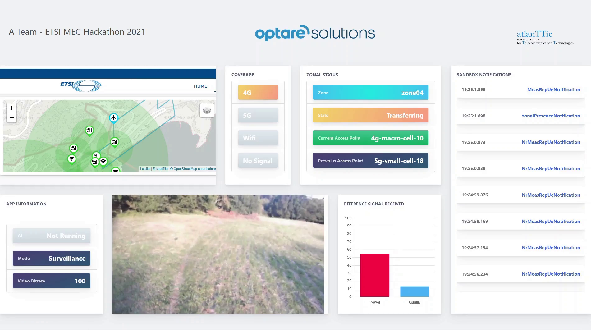

# A TEAM - ETSI MEC Hackathon 2021 - Follow MEC

## Description

This module is a component of the "Follow MEC" application that is participating in the ETSI MEC HAckathon 2021.

This element is responsible to consume the Sandbox notifications, retrieve the Edge Services information and communicate it to the Follow Me AI module. This communication is established via mqtt topics where both notifications consumer and the AI module are subscribed, so it is a bidirectional communication.

With the information from the AI module, the notifications consumer publishes an information dashboard for monitoring, where the information extracted from the sandbox notifications and the information retrieved from the AI module can be seen.

## Scenario



## Dashboard

The next image is a capture from the Follow Mec Dashboard:



All the Information shown is updated in real time:
- Sandbox Map: the route followed by the drone in surveillance mode can be seen. In Tracking mode, an alerting image appears.
- Coverage Section: depending on the coverage area where the drone is passing through, it shows: 4G, 5G, Wifi or No Signal.
- Zonal Status Section: shows the zone information where the drone is flying, reflecting the current access point, the previous one, etc.
- Sandbox Notifications: shows the latest types of notifications received from the sandbox and the time they were received.
- Reference Signal: in 4G/5G cases, it shows the reference signal power and quality received in the zone where the drone is flying.
- Video Streaming: 
  - 5G/Wifi cases: shows the AI inferenced video stream in higher quality
  - 4G cases: shows the AI inferenced video stream in lower quality
  - No Signal: shows a "No signal" image
-  App Information Section: shows the mode in which the drone is operating (surveillance/tracking) and the video bit rate received from the Follow Mec AI module.

## Tools

In src/tools is included a bash script and a set of json files to automatize the drone path creation and the sandbox subscriptions.

```
./create_scenario.sh

This script creates the ETSI MEC Hackathon Scenario

Usage: create_scenario.sh <parameter>
 - all: It creates drone UE and all subscriptions (location, rni, wai)
 - drone: It creates drone UE
 - location: It creates the location usertracking subscription
 - rni: It creates all the rni subscriptions
 - wai: It creates all the wai subscriptions
```
